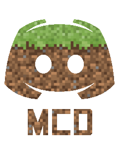

# What?
MCD (**M**ine**C**raft <-> **D**iscord Relay) is a bidirectional relay between Minecraft and Discord with extensive configuration options. You can change how the messages are formatted and whether or not to use a webhook to send messages.

# Setup
For a basic setup:
1. Install the MCD plugin and start up your Minecraft server. MCD will say that there was an error while starting. That is normal.
2. Create an application at [Discord's developer portal](https://discordapp.com/developers).
3. Add a bot to the application.
4. Copy the token for the bot.
5. Open up MCD's configuration and put it in the `bot-token` option.
6. Enable Developer Mode on Discord if you haven't already. Go to your user settings, appearance and click Developer Mode.
7. Go to your guild and find the channel where you want to bot to relay messages to and from.
8. Right click on the channel's name and click `Copy ID`.
9. In the configuration, paste in that ID under the `relay-channel` option.
10. Invite your bot by going to the OAuth2 URL generator and setting the scope to bot, opening the generated URL and inviting it.
11. Make sure that the bot can read your relay channel.
12. Reload your Minecraft server.

# Configuration
Configuration options are found at the [wiki](https://github.com/ZeroIdeaDevelopment/MCD/wiki).
